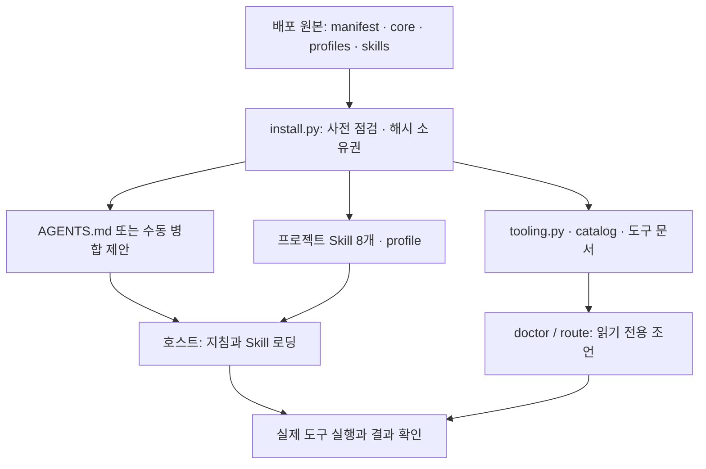

# Harness 3.0 심층 감사

2026-09-26 · 기준 `218e2a40de5001fbf185c94e2c229148079ebcb9` · VERSION `3.0.0`

## 판단

**3.0은 과도한 오케스트레이터보다 작은 지침·설치·진단 계층에 가깝습니다. 유지할 가치가 있으나, 실제 에이전트 품질 향상은 아직 입증되지 않았습니다.** 새 기능은 7개 workflow를 전면 개편한 것이 아니라 `uh-tooling` 1개, provider 12개/capability 11개 catalog, 읽기 전용 doctor와 advisory router입니다. 설치된 파일, 호스트 노출, 인증, 실제 검증을 구분하는 설계는 명확합니다.

기준 패키지 검사는 82개가 통과했으나, 별도 경계 실험에서 손상된 원본 설치, 불완전한 metadata 추천, 탐색 상한 우회 등 결함을 재현했습니다. 이번 브랜치는 작은 안정화 변경입니다. 버전은 유지하며 출시한다면 **3.0.x** 범위가 적절합니다. 디렉터리 재설계·Skill 삭제·프로필 개편은 구현하지 않았습니다.

**No Harness / 3.0 / 3.0+Skill의 통제된 모델 비교는 NOT RUN입니다.** 이 세션은 Codex CLI가 없는 Work/Linux 환경입니다. 모델별 fresh-context 실행, 실제 Mac/global Skill 목록, reasoning effort별 비용·성능, 외부 MCP·브라우저의 인증/호출은 측정하지 않았습니다. 패키지 PASS를 Astra/Sol 행동 PASS로 바꾸지 않습니다.

## 증거 등급과 범위

| 표기 | 의미 |
|---|---|
| EXECUTED | 실제 스크립트·CLI·파일시스템 실행입니다. fake PATH/주입 장애 여부를 별도 기록합니다. |
| SOURCE | 고정 revision의 소스/문서를 직접 확인한 사실입니다. |
| INFERENCE | 소스에서 도출했지만 실제 에이전트 행동으로 확인하지 않은 판단입니다. |
| SIMULATED | 요청별 기대 행동·가상 충돌의 분석입니다. 실행 결과가 아닙니다. |
| NOT RUN / UNKNOWN | 미실행 또는 관측 불가입니다. |

전체 배포 payload, 8개 Skill, 3개 profile, installer/tooling/validator, 기존 tests/evals 및 주요 도입·모델·도구 문서를 조사했습니다. 증거는 [실험 기록](HARNESS_3_EXPERIMENTS.md)과 `evals/audit-2026-09-26/evidence/`에 있습니다. 비공개 비교 저장소는 읽기만 수행했으며 상세 내부 근거는 별도 비공개 부록으로 분리했습니다.

## 실제 구조

- 진입점은 개발 저장소의 `AGENTS.md`와 소비자용 `AGENTS.template.md`가 구분되어 있습니다. 원본 `skills/`는 배포 payload이며 소비자 호스트 탐색 위치는 `.agents/skills/`입니다.
- `scripts/install.py`는 충돌을 먼저 계산하고 파일별 atomic replace 후 STATE를 마지막에 기록합니다. 전체 설치 트랜잭션은 아닙니다. 기존 AGENTS는 `AGENTS.proposed.md`로 수동 병합하며 core activation을 자동으로 선언하지 않습니다.
- `STATE.json`은 파일 소유권/업그레이드 보호용입니다. 모델 checkpoint, 진행 상황 DB, 실행 완료 증명으로 쓰이지 않습니다.
- profile은 작은 호환성 메모입니다. model ID·effort·Codex config를 변경하지 않습니다.
- agent 역할 파일, hooks, task scheduler, dependency installer, 자동 재시도 엔진은 이 배포물에 없습니다. 계획·완료·context handoff는 core의 지침이며 host가 실행합니다.
- doctor는 파일/PATH 관찰, route는 정해진 capability ID의 provider 후보 선택입니다. 자연어 semantic router나 실제 provider health check가 아닙니다.
- CI는 3개 OS의 패키지/설치 테스트이며 모델 평가를 실행하지 않습니다.

## 확인된 문제와 수정

| ID | 증거·재현 | 영향 / 반론 검토 | 이번 처리 |
|---|---|---|---|
| F01 | 원본 `uh-debug/SKILL.md`를 metadata 없는 텍스트로 바꾸면 설치 exit 0, 손상 파일 배포가 재현됐습니다. 두 번째 점검에서는 tooling support mapping 누락도 통과했습니다. | 설치 성공과 활성화는 이미 구분하지만, 배포 시 검출 가능한 결함을 넘기는 문제는 남습니다. 실제 무변경 사전 실패로 개선할 가치가 있습니다. | 원본 name/description·이름 일치·크기, 필수 tooling mapping/catalog를 쓰기 전에 확인합니다. |
| F02 | name만 있는 Skill, `name:find-skills`, collection 형태의 손상 description이 fake npx PATH와 결합해 `find-skills` 후보가 됐습니다. | readiness는 원래 unverified이므로 실행 성공 위조는 아닙니다. 다만 명백히 사용할 수 없는 metadata를 경고 없이 후보에 넣었습니다. | 기본 필수 필드 검사와 지원 범위를 명시합니다. 전체 YAML 검증이라고 주장하지 않습니다. |
| F03 | `MAX_DIRS=4`에서 같은 대상 symlink 40개를 모두 읽고 경고가 없었습니다. | unique real path만 세어 노출 개수의 상한이 없었습니다. hostile code execution은 재현되지 않았습니다. | 별칭을 포함한 directory visit을 계산합니다. 동일 fixture에서 3개 정의+한도 경고입니다. |
| F04 | 존재하지 않는 대상으로 향하는 하위 skill symlink가 0개/경고 없음으로 처리됐습니다. | 없는 optional Skill과 설치 손상 구별이 사라지는 조용한 누락입니다. | 끊어진 skill-tree 링크를 경고합니다. |
| F05 | STATE나 run-record를 JSON 배열/null로 바꾸면 AttributeError traceback이 발생했습니다. | 쓰기 전 실패라 데이터 손상은 없었습니다. 복구 가능한 입력 오류의 설명 품질 문제입니다. | object/type guard로 명시적 오류를 반환하고 기존 파일을 보존합니다. |
| F06 | Skill 1,000개에서 route 하나의 CLI 출력이 310,330 bytes였습니다. | 전체 목록은 진단에는 유용합니다. 매번 agent context로 반환하면 비용이 커지는 문제입니다. 모델 지연 자체는 미측정입니다. | 호환성을 유지하는 `--summary` 추가: 같은 route 1,413 bytes, 99.54% 감소입니다. |
| F07 | 도입 가이드는 일곱 개라고 설명하지만 manifest/실제 설치는 여덟 개입니다. | 작은 문서 결함입니다. | 여덟 개로 수정했습니다. |
| F08 | 설치된 `uh-model-upgrade`가 `evals/README.md`를 참조하지만 그 문서는 설치되지 않습니다. | 원본 checkout에서는 경로가 유효합니다. 소비자 프로젝트에서의 소유 위치가 불명확했습니다. | 원본 checkout의 문서임을 명시하고, 없을 때 한계를 보고하도록 했습니다. |

F01~F05는 [새 회귀 테스트](tests/test_audit_regressions.py)와 원시 before/after probe로 검증했습니다. F06은 실제 CLI 출력 비교입니다. F07/F08은 파일·참조 위치의 직접 확인이며 자연어 지시 준수 실험으로 주장하지 않습니다.

## 강점

1. 기본 core 5,799 bytes이며 Skill 전체 상시 로딩을 금지합니다. 계획서·상시 역할 체인·무한 리뷰를 요구하지 않습니다.
2. 권한은 지침으로 생성되지 않으며, 검사 실패 후 다른 도구로 승인을 우회하지 않도록 명시합니다.
3. 단위/통합/브라우저/실서비스 증거를 구분하고, flaky의 뒤늦은 PASS가 최초 실패를 지우지 않도록 합니다.
4. 이름 중복을 본문 동일/상이/symlink alias로 구분합니다. local override를 보장하지 않습니다.
5. 원본 누락, 사용자 수정, 관리되지 않는 AGENTS, profile 변경, ZIP·비 Git 설치가 기존 테스트에 포함됩니다.
6. 중단된 신규 설치에서 STATE가 없는 채 파일 3개만 기록된 상황을 실제 installer+주입 장애로 만들었으며, 같은 package 재실행으로 복구됐습니다.

## 의심 사항·확인된 한계

| 항목 | 판단·추가 증거 |
|---|---|
| 무관한 Skill 오류 하나가 모든 route를 fallback으로 바꿉니다. | EXECUTED로 확인한 보수적 설계입니다. 잘못된 추천을 막는 이득도 있어 즉시 변경하지 않았습니다. provider별 영향 분류는 3.1 후보입니다. |
| `uh-tooling`이 넓은 문서를 읽게 합니다. | SOURCE: Skill 2,846 bytes에 도구 계약 문서가 추가됩니다. 전체 문서가 실제로 항상 로드되는지는 UNKNOWN입니다. capability별 부분 로딩을 제안합니다. |
| description/YAML 검사가 일부 형식만 다룹니다. | 패치 후에도 전체 YAML/parser, `agents/openai.yaml`, supporting files, dependency DAG, version compatibility는 검증하지 않습니다. |
| 대규모 탐색의 자원 상한이 불완전합니다. | directory visits와 파일당 bytes는 제한하지만, 한 디렉터리의 entry 수·전체 I/O·경로 깊이·총 JSON bytes를 엄격히 제한하지 않습니다. |
| core와 karpathy/ponytail/profile의 의미 중복 | SOURCE/INFERENCE입니다. 기본 모델 능력과 중복할 가능성은 있으나 효능 실험 없이 삭제하지 않았습니다. |
| profile의 많은 규칙이 universal입니다. | 모델별 효능이 아니라 설계용 메모에 가깝습니다. medium/high/x-high별 차등 강제는 근거 부족입니다. |
| generic ML 예시의 작은 학습/held-out 접근 | 승인된 데이터·실험 경계 안에서만 적용해야 합니다. 비공개 CV 비교에서 이 구분의 중요성을 확인했습니다. 실제 무단 실행은 발생하지 않았습니다. |

## 폐기하거나 범위를 낮춘 주장

- “빈 프로젝트에는 global Skill이 반드시 있어야 한다”: 폐기합니다. 격리된 global 빈 목록에서 3개 profile이 설치·탐색에 성공했습니다.
- “같은 Skill은 local이 항상 global을 덮는다”: 근거가 없습니다. 코드가 그런 우선순위를 구현하지 않습니다.
- “Skill 8개가 항상 전부 로드된다”: 폐기합니다. 패키지 배포와 본문 로딩은 다릅니다.
- “doctor PASS는 인증/실행 PASS다”: 폐기합니다. 모든 readiness는 unverified입니다.
- “핵심 설계가 웹 전용이다”: 폐기합니다. ML/장치 예시와 TDD의 stochastic 품질 구분이 있습니다. 프로젝트별 평가 계약은 별도로 필요합니다.
- “82/94 테스트 통과로 모델이 더 정확해졌다”: 폐기합니다. 모델 비교가 아닙니다.
- “alias 공격은 원격 코드 실행이다”: 폐기합니다. 확인된 영향은 탐색/출력 상한입니다.

## 변경으로 새로 생길 수 있는 회귀

필수 필드 검사 강화로 복잡한 유효 YAML도 unsupported 경고가 될 수 있습니다. multiline/quoted/BOM/CRLF 경로를 회귀로 확인했고, parser의 한계를 표시했습니다. 경고가 모든 route를 막는 기존 정책 때문에 fallback이 늘어날 수 있습니다. 전체 YAML 지원은 새 의존성·호스트 호환성 검토가 필요한 후속안입니다.

`--summary`는 opt-in이므로 기존 full JSON 계약을 유지합니다. strict 종료 코드·route 결과·readiness는 바뀌지 않습니다. 설치기는 계속 파일별 atomic이며 동시 편집이나 여러 설치기의 경쟁을 막는 sandbox가 아닙니다. core/model profile의 정책은 바꾸지 않았습니다.

## 최종 질문에 대한 답

- **이전보다 강해졌습니까?** 도구 상태·중복·fallback을 표현하는 구조가 추가됐습니다. 실제 agent acceptance 개선은 아직 모릅니다.
- **Skill이 성능을 높입니까?** 8개는 작고 선택형이지만, 가장 확실한 가치는 재현·증거·프로젝트 경계입니다. 일반 사고법을 다시 가르치는 부분의 순효용은 평가가 필요합니다.
- **무엇을 global/local로 둬야 합니까?** 일반 도구 사용법은 global 후보이고, 프로젝트 불변식·데이터/평가/실행 권한·정확한 검증 명령·인덱스는 local입니다. 동일 이름을 양쪽에 복제하는 배포는 피하는 편이 낫습니다.
- **수백 개를 견딥니까?** synthetic 파일 1,000개는 스캔했습니다. 의미 선택 정확도·host metadata 누락·장시간 행동은 확인하지 못했습니다. 전체 목록을 매번 context에 넣으면 안 됩니다.
- **최소 핵심 가치는 무엇입니까?** 요청된 완료 조건, 기존 작업과 프로젝트 불변식 보존, 권한의 실제 경계, 재현 가능한 검증, 정확한 미검증 표시입니다.
- **더 크게 만들지 않고 강하게 만들 수 있습니까?** 가능합니다. 이번 수정은 새로운 역할/플러그인/Skill 없이 preflight·오류 진단·출력량·참조 정확도를 개선했습니다.

다음 단계는 [개선 제안](HARNESS_NEXT_PROPOSAL.md)에 있습니다. 감사 문서는 설치 payload나 상시 context에 추가하지 않습니다.
