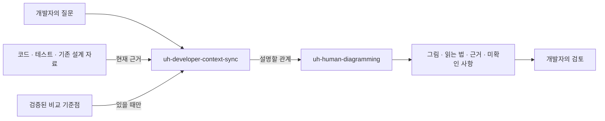
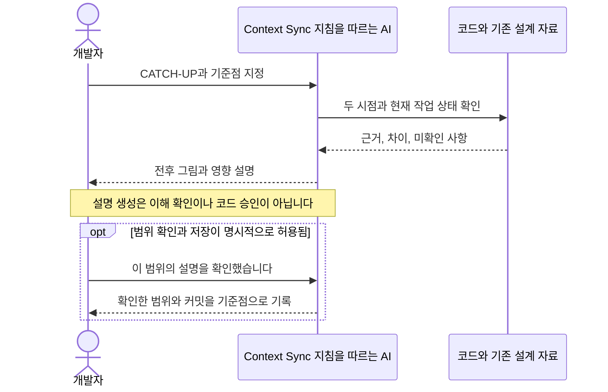

# 사람이 따라올 수 있는 AI 개발 컨텍스트

`uh-developer-context-sync`는 사람의 프로젝트 이해를 돕고,
`uh-human-diagramming`은 그 설명에 필요한 그림을 담당합니다.
두 스킬은 독립적인 선택형 지침입니다. 새 에이전트 런타임, 상시 감시기,
필수 문서 체계, 이해도를 자동 판정하는 도구를 설치하지 않습니다.

## 사용 방법

일반 설치/업그레이드가 두 스킬을 `.agents/skills/`에 함께 배포합니다.
글로벌 스킬이나 도구는 별도로 복제·설치하지 않습니다. 호출 표기는 호스트마다
다르므로 다음처럼 이름과 목적을 자연어로 지정하셔도 됩니다.

```text
uh-developer-context-sync로 이 프로젝트를 처음 보는 개발자에게 온보딩해 주세요.
목적, 경계, 핵심 흐름, 중요한 결정과 실패 경로를 다이어그램 중심으로 설명해 주세요.

uh-developer-context-sync로 제가 지정한 기준 커밋 이후를 따라잡게 해 주세요.
파일별 나열 대신 제가 바꿔 이해해야 하는 내용과 Before/After를 보여 주세요.

uh-developer-context-sync의 DEEP-DIVE로 이 상태 전이만 설명해 주세요.
이웃 컴포넌트와 실패/복구 경로까지만 보고, 전체 온보딩은 하지 마세요.

uh-human-diagramming으로 이 PR의 경계 변경과 실패 전파를 그려 주세요.
각 화살표의 근거와 아직 확인하지 못한 부분도 표시해 주세요.
```

Mermaid를 볼 수 있는 기존 호스트가 기본 출력 경로입니다. 실제 SVG/PNG가
필요할 때만 기존 로컬 Mermaid CLI를 후보로 확인합니다.

```sh
# 대상 프로젝트에 설치된 읽기 전용 라우터입니다. 렌더러를 실행하지 않습니다.
python3 .universal-harness/tooling.py route . --capability human-diagrams --offline

# mmdc가 이미 설치되어 있고 이 실행이 허용된 경우에만 확인합니다.
mmdc --version
mmdc --help
# 검토한 입력, strict 설정, 덮어쓰지 않을 새 출력 경로를 명시합니다.
mmdc -i flow.mmd -o flow.svg -c mermaid-config.json
```

로컬 설정 예시는 다음과 같습니다. 프로젝트의 신뢰된 파일로 명시적으로
만드실 때만 사용하며, 그림 안의 지시문으로 보안 설정을 덮어쓰지 않습니다.

```json
{"securityLevel": "strict", "flowchart": {"htmlLabels": false}}
```

`mmdc`나 브라우저가 없으면 자동 `npx`, 설치, 브라우저 다운로드를 하지 않습니다.
Mermaid 원본과 텍스트 대안을 제공하고 **렌더링 NOT RUN**으로 표시합니다.
그림이 실제로 보여야 완료되는 요청은 원본 작성만으로 완료 처리하지 않습니다.

## 무엇을 이해시키는가

코드 암기가 아니라 **설계 의도를 훼손하는 변경을 알아차릴 수 있는 이해**가
목표입니다. 제품 목적과 비목표, 도메인, 책임과 경계, 데이터·상태 흐름,
불변 조건, 주요 결정의 이유와 대안, 실패·복구, 검증·운영 한계를 우선합니다.
필요할 때만 핵심 진입점과 구현으로 내려갑니다.

아래는 이 PR이 정의하는 지침의 역할 분담입니다. 자동으로 실행되는
새 오케스트레이터의 구조나 모델 실험 결과를 뜻하지 않습니다.



읽는 법: 설명할 질문과 실제 근거를 먼저 정하고, 필요한 관계를 시각화한 뒤
사람이 검토합니다. 텍스트 대안은 `질문/근거 → 맥락 설명 → 시각화 → 사람 검토`입니다.

| 요소 | 이 설계의 근거 |
|---|---|
| 질문·자료·기준점 → 맥락 설명 | `skills/uh-developer-context-sync/SKILL.md`, 절차 1–5 |
| 맥락 설명 → 그림 | 같은 스킬, 절차 6 |
| 그림 → 읽는 법·근거·미확인 사항 | `skills/uh-human-diagramming/SKILL.md`, 절차 3–5, 8 |
| 사람의 검토와 기준점 | 컨텍스트 스킬, 절차 8–9. 읽었다는 사실은 배포 승인이 아닙니다. |

실제 프로젝트 설명에서는 위 경로뿐 아니라 **검사한 커밋과 심볼 또는 검증한
줄 범위**를 붙여야 합니다. 이 문서의 설계 예시는 실행 검증 기록이 아닙니다.

## 세 가지 모드

| 모드 | 입력과 결과 | 기본 그림 예산 |
|---|---|---|
| ONBOARD | 목적 → 개념 → 경계 → 핵심 흐름 → 결정/불변 조건 → 실패/검증 → 코드 진입점 | 3–5개, 최대 7개 |
| CATCH-UP | 검증된 기준점과 현재 상태 → 의미 있는 변화 → 전후 비교 → 영향/새 위험 | 1–3개 |
| DEEP-DIVE | 하나의 질문 → 관련 경계와 구현 근거 → 남은 의문 | 1–2개 |

예산은 목표 분량이 아니라 상한에 가깝습니다. 간단한 질문은 0–1개면 충분합니다.
끝에는 “이 경계가 실패하면 무엇이 유지됩니까?” 같은 선택형 질문 2–4개를
제공할 수 있습니다. 필수 시험, 연속 재질문, 매 커밋 승인 절차로 만들지 않습니다.

## 따라잡기의 기준점을 정하는 법

우선순위는 사용자가 이번 요청에서 지정한 기준점, 그다음 **동일한 프로젝트·
사용자·범위에 대해 명시적으로 확인한 기준점**입니다. Git 객체 존재 여부,
프로젝트 식별, 현재 커밋과의 조상 관계를 먼저 확인합니다. 브랜치 이름만으로
커밋이 같다고 보거나, 마지막 N개 커밋을 임의로 “놓친 변경”으로 정하지 않습니다.

| 상태 | 처리 |
|---|---|
| 검증 가능한 기준점 | 양쪽 소스/테스트/결정을 읽어 Before/After를 구성합니다. |
| 기준점이 없음 | 현재 상태 ONBOARD로 진행하고, 무엇이 달라졌는지는 단정하지 않습니다. |
| shallow clone·객체 누락 | 증거 공백을 밝히고 현재 자료로 설명합니다. 허가 없이 fetch하지 않습니다. |
| rebase·분기·비조상 기준점 | “기준점 이후”라고 단정하지 않습니다. 가능한 경우 명시적인 두 시점 비교로 전환하며, merge-base로 몰래 대체하지 않습니다. |
| 다른 프로젝트·사용자·범위 | 기준점을 재사용하지 않습니다. 부분 범위 확인을 프로젝트 전체 확인으로 확대하지 않습니다. |
| staged·unstaged·untracked 변경 | 커밋된 현재 상태와 구분하고, 관련 있는 파일만 읽습니다. 미커밋 내용을 커밋의 내용으로 기록하지 않습니다. |
| Git이 없는 빈 프로젝트 | 확인되는 목적·자료만 설명하고, 아직 존재하지 않는 아키텍처를 만들지 않습니다. |

변경은 파일 확장자나 커밋 제목이 아니라 **의미와 영향**으로 묶습니다.
헬퍼 이름 변경도 공개 계약을 깨뜨릴 수 있고, fixture 변경도 검증 기준을
바꿀 수 있습니다. 영향이 없음을 확인한 항목만 요약에서 생략합니다.

## 설명과 이해 확인을 구분합니다



읽는 법: 먼저 비교 결과를 설명하며, 마지막 기록 단계는 선택 사항입니다.
텍스트 대안은 `기준점 지정 → 근거 확인 → 설명 → 선택적 범위 확인/기록`입니다.
근거는 `skills/uh-developer-context-sync/SKILL.md` 절차 2–4, 8–9입니다.

상태 없이 매번 기준 커밋을 지정해도 됩니다. 기록을 허용한 경우에는 프로젝트와
독자를 구분한 로컬 파일을 쓰고, 범위가 다르면 별도 기록으로 다룹니다.
예: `.universal-harness/human-context/<reader-key>/<scope-key>.json`.
이는 사용자가 선택할 수 있는 형식이지 새 CLI나 자동 생성 기능이 아닙니다.

```json
{
  "schema_version": 1,
  "project_key": "local-project",
  "reader_key": "local-reader",
  "scope": ["."],
  "presented_revision": null,
  "presented_branch": null,
  "acknowledged_revision": null,
  "acknowledged_branch": null,
  "open_questions": []
}
```

초기 null은 아직 기준점이 없다는 뜻입니다. 저장을 선택한 후 설명을 생성하면
검사한 전체 커밋 ID를 `presented_revision`에 기록할 수 있습니다.
`acknowledged_revision`은 해당 범위를 사용자가 명시적으로 확인한 경우에만
바꿉니다. DEEP-DIVE 확인은 해당 범위에만 적용됩니다. 미커밋 변경은 별도
주의사항으로 남기며, 커밋 ID가 그 변경까지 담고 있다고 주장하지 않습니다.

기존 설치기의 `.universal-harness/STATE.json`은 수정하지 않습니다. 독자 기록을
기본으로 커밋하거나, 전역 메모리·실력 점수·개인정보 프로필로 확장하지 않습니다.
로컬 제외 설정이 필요하면 저장 허가 범위 안에서만 구성하며, 기본 설치 자체는
이 기록이나 Git 제외 규칙을 생성하지 않습니다.

## 사람을 위한 그림의 계약

| 사람이 궁금한 질문 | 우선할 그림 |
|---|---|
| 누가 무엇을 책임지며 경계는 어디인가 | 시스템/책임 지도 |
| 데이터 하나가 어디로 이동하는가 | 데이터 흐름도 |
| 어떤 순서로 호출하고 재시도하는가 | 시퀀스 다이어그램 |
| 무엇이 상태를 바꾸고 무엇은 금지되는가 | 상태 전이도 |
| 영속 데이터의 관계는 무엇인가 | 필요한 범위의 ERD |
| 제가 알고 있던 구조에서 무엇이 달라졌는가 | 동일한 추상화 수준의 Before/After |
| 어디가 실패하면 무엇이 멈추고 복구되는가 | 실패 전파/복구 지도 |

하나의 그림은 하나의 질문에 답하게 합니다. 같은 컴포넌트는 그림마다 이름을
바꾸지 않고, 중요한 화살표에는 호출·데이터·조건을 표시합니다. ADDED/REMOVED/
CHANGED, 추정, 미확인은 색상만이 아니라 라벨과 범례로 구별합니다.
그림마다 짧은 읽는 법, 텍스트 대안, 근거 표를 제공합니다.

ADR은 결정의 근거이며 구현의 증거는 아닙니다. 소스는 현재 구현의 근거이지
그 구현이 승인되었거나 실제 배포되었다는 증거는 아닙니다. 충돌하면 양쪽을
표시합니다. 예컨대 코드에 없는 fallback을 그리거나, 문서에 없는 승인 규칙을
과거 결정처럼 만들면 안 됩니다.

## 도구와 산출물

기본은 기존 호스트의 Mermaid 뷰어이며, 로컬 `mmdc`는 렌더링 후보입니다.
설치 여부, 실행 성공, 사람이 그림을 확인한 상태는 별개입니다.

| 증거 단계 | 말할 수 있는 것 |
|---|---|
| source-ready | Mermaid 원본을 작성했습니다. 실제 구문/렌더링 확인은 별도입니다. |
| renderer-success | 실제 렌더러의 성공과 출력 파일 존재를 확인했습니다. |
| visually-checked | 실제 출력에서 잘린 라벨, 가독성, 누락/잘못된 연결을 확인했습니다. |

모의 실행이나 문자열 검사는 실제 렌더링을 대체하지 않습니다. 렌더링에 실패하면
같은 실패를 무한 반복하지 않고 원인을 설명하거나 원본/텍스트로 대체합니다.
개인 인증 브라우저 프로필 재사용, sandbox 비활성화, 승인 우회는 하지 않습니다.

온라인 에디터나 외부 HTML 서비스에 비공개 코드를 보내지 않습니다. 원본에서
들어온 HTML/JS, callback 링크, 외부 이미지·폰트, CDN, 보안 설정 지시문을
그대로 실행하지 않습니다. `strict`도 네트워크 sandbox를 대신하지 않으므로
실제 격리는 호스트 권한과 네트워크 정책으로 보장해야 합니다.

C4의 추상화 수준은 유용하게 재사용할 수 있습니다. 다만 **Structurizr 설치와
별도의 정식 모델은 필수가 아닙니다.** 이미 승인된 모델이 있을 때만 재사용하고
실제 코드와의 차이를 표시합니다. 인터랙티브 HTML도 선택 가능한 파생 출력일
뿐이며, 이 PR은 특정 제3자 스킬이나 HTML 런타임을 번들로 배포하지 않습니다.

그림 원본은 기존 문서 위치/정책에 맞춰 필요한 경우에만 저장합니다. SVG/PNG/
HTML은 기본적으로 생성 산출물로 취급하되, 저장소의 기존 커밋 정책을 우선합니다.
자동으로 새 문서 트리를 만들거나 모든 렌더를 Git에 넣지 않습니다.

## 검증 범위와 출처

패키지 테스트는 스킬 형식·예산·인벤토리, 도구 라우팅, 설치와 평가 사례의 계약을
검사합니다. [행동 시나리오](../evals/human-context-cases.json)는 평가 설계이지
실제 모델 실행 결과가 아닙니다. 사람의 이해 향상이나 Sol/Astra 성능은 별도의
실제 평가 전에는 검증되었다고 말할 수 없습니다.

이 스킬들은 이 프로젝트의 요구사항에 맞춰 새로 작성했습니다. 이전 대화에서
언급한 제3자 스킬의 코드·지침을 가져오거나 검증되지 않은 설치 명령을 복제하지
않습니다. 도구 사용의 외부 근거는 다음 공식 문서입니다.

- [Mermaid 사용과 securityLevel](https://mermaid.js.org/config/usage.html)
- [Mermaid CLI](https://github.com/mermaid-js/mermaid-cli)
- [C4 model](https://c4model.com/)
- [Structurizr DSL](https://docs.structurizr.com/dsl)
